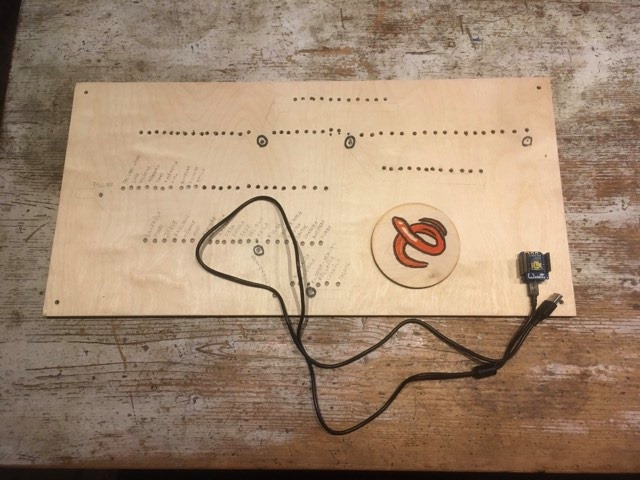

# Elroni kaart

Autorid/By Jasper Liiberg, Timo Toots  
Made in Maajaam Studio  

# Hardware/Riistvara:

* Wemos D1 Mini
https://www.aliexpress.com/item/32529101036.html

* 1-Button shield
https://www.aliexpress.com/item/32575988167.html

* APA106 LED RGB
https://www.aliexpress.com/item/32672143824.html

* OLED Shield
https://www.aliexpress.com/item/32627787079.html

* Dual Base Shield
https://www.aliexpress.com/item/32642733925.html

# How to program / Kuidas programmeerida?

* Install CH340 Driver for Windows/Mac/Linux

	* https://learn.sparkfun.com/tutorials/how-to-install-ch340-drivers/all

* Install Arduino IDE and open

	https://www.arduino.cc/en/Main/Software

* In "Preferences" install ESP8266

	* Additional Boards manager:

	http://arduino.esp8266.com/stable/package_esp8266com_index.json

* Tools -> Manage Libraries, install these libraries

	* AutoConnect  
	* FastLED  
	* ArduinoJson

* Tools -> Board

	* Select: LOLIN(WEMOS) D1 R2 & mini

* Tools -> Port

	* Select: /dev/cu.wchusbserial-XXXX

* Connect to USB cable

* Upload

# Change wifi

* Log in to "elronikaart" wifi network 

* Configure new network

* Restart

# Enjoy Elron!

